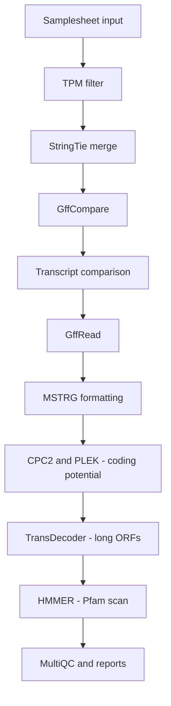

<h1>
  <picture>
    <source media="(prefers-color-scheme: dark)" srcset="docs/images/nf-core-not2code_logo_dark.png">
    
  </picture>
</h1>

[](https://nf-co.re/not2code/results)[](https://doi.org/10.5281/zenodo.XXXXXXX)
[](https://www.nf-test.com)

[](https://www.nextflow.io/)
[](https://docs.conda.io/en/latest/)
[](https://www.docker.com/)
[](https://sylabs.io/docs/)
[](https://cloud.seqera.io/launch?pipeline=https://github.com/nf-core/not2code)

[](https://nfcore.slack.com/channels/not2code)[](https://twitter.com/nf_core)[](https://mstdn.science/@nf_core)[](https://www.youtube.com/c/nf-core)

## Introduction

**not2code** is a bioinformatics pipeline designed to annotate long non-coding RNAs (lncRNAs) from transcriptome assemblies from small bulk RNA-seq data. It works by filtering, comparing, and characterizing transcripts from GTF files, which can be generated by tools such as StringTie via nf-core/rnaseq.

The pipeline performs the following key steps:

- Filtering assembled transcripts by expression (TPM >= 1)

- Merging assemblies across samples

- Classifying transcripts based on coding potential

- Annotating protein domains in predicted open reading frames (ORFs)

- Generating reports with MultiQC

It supports a modular design and can be easily extended or integrated into custom analyses.

## Modules and Tools

This pipeline uses a combination of nf-core and custom modules:

- samplesheet_check

- gtf_filter_tpm

- stringtie/merge

- gffcompare

- compare_transcriptomes

- gffread

- mstrg

- cpc2

- plek

- transdecoder/longorfs

- hmmer/hmmpress, hmmer/hmmsearch

- multiqc


## Workflow Overview



## Usage

> [!NOTE]
> If you are new to Nextflow and nf-core, please refer to [this page](https://nf-co.re/docs/usage/installation) on how to set-up Nextflow. Make sure to [test your setup](https://nf-co.re/docs/usage/introduction#how-to-run-a-pipeline) with `-profile test` before running the workflow on actual data.

The `not2code` pipeline requires assembled transcriptomes (GTF files) as input. A typical workflow involves running `nf-core/rnaseq` first to align reads and assemble transcripts, followed by `dalmolingroup/not2code` to identify lncRNAs.

### 1. Run nf-core/rnaseq

First, run `nf-core/rnaseq` with an aligner like HISAT2. You should also ensure StringTie is properly parameterized to preserve transcripts that are candidates for lncRNAs (e.g. modifying minimum junction coverage, minimum read coverage, and minimum length). 

Here is an example of creating a custom configuration for StringTie and running the `rnaseq` pipeline:

```bash
# Create custom StringTie configuration
echo "process {
    withName: 'NFCORE_RNASEQ:RNASEQ:STRINGTIE_STRINGTIE' {
        ext.args = { 
            [
                '-j 3',
                '-c 3',
                '-m 200',
                params.stringtie_extra_args ?: ''
            ].join(' ').trim() 
        }
    }
}" > stringtie.config

# Run nf-core/rnaseq
nextflow run nf-core/rnaseq \
  -profile docker \
  -r 3.19.0 \
  --input rnaseq_samplesheet.csv \
  --outdir results_rnaseq \
  --fasta /path/to/genome.fna \
  --gtf /path/to/genome.gtf \
  --trimmer fastp \
  --aligner hisat2 \
  --skip_pseudo_alignment \
  -c stringtie.config
```

### 2. Prepare the input samplesheet

After the `rnaseq` pipeline finishes, you need to prepare a samplesheet for `not2code`. The samplesheet requires two columns: `sample` and `gtf`. You can create this automatically from the `rnaseq` StringTie outputs using the following bash script:

```bash
# Output samplesheet file
output="gtf_samplesheet.csv"

# Write header
echo "sample,gtf" > "$output"

# List .transcripts.gtf files and process each one
for path in results_rnaseq/hisat2/stringtie/*transcripts.gtf; do
    sample=$(basename "$path" .transcripts.gtf)
    echo "$sample,$(realpath $path)" >> "$output"
done
```

This will create a `gtf_samplesheet.csv` that looks like this:

```csv
sample,gtf
CONTROL_REP1,/path/to/results_rnaseq/hisat2/stringtie/CONTROL_REP1.transcripts.gtf
```

### 3. Run nf-core/not2code

Now, you can run the `not2code` pipeline using the generated samplesheet:

```bash
nextflow run dalmolingroup/not2code \
  -profile docker \
  --input gtf_samplesheet.csv \
  --reference_gff /path/to/genome.gff \
  --reference_gtf /path/to/genome.gtf \
  --reference_genome /path/to/genome.fna \
  --pfam_db /path/to/Pfam-A.hmm \
  --outdir results_not2code
```


## Pipeline output

To see the results of an example test run with a full size dataset refer to the [results](https://nf-co.re/not2code/results) tab on the nf-core website pipeline page.

The pipeline will create a simplified output structure under the designated `--outdir` parameter (e.g. `results/`):

* `lncRNA_candidates/`: Contains the final GTF files for identified lncRNAs.
* `coding_potential/`: Contains the evaluation of coding/non-coding capability from tools like CPC2, PLEK, and HMMER scans.
* `transcriptome_assembly/`: Contains intermediate merged transcriptomes, and GTF files from gffcompare and TPM filtering.
* `multiqc/`: General aggregate quality control report.
* `pipeline_info/`: Generic logs and reports relating to the execution of the Nextflow pipeline.

For more details about the output files and reports, please refer to the
[output documentation](https://nf-co.re/not2code/output).

## Credits

not2code was developed by @gleisonm and @rafaellaferraz.

## Citations

If you use dalmolingroup/not2code for your analysis, please cite it using its Digital Object Identifier (DOI).

An extensive list of references for the tools used by the pipeline can be found in the [`CITATIONS.md`](CITATIONS.md) file.

You can cite the `nf-core` publication as follows:

> **The nf-core framework for community-curated bioinformatics pipelines.**
>
> Philip Ewels, Alexander Peltzer, Sven Fillinger, Harshil Patel, Johannes Alneberg, Andreas Wilm, Maxime Ulysse Garcia, Paolo Di Tommaso & Sven Nahnsen.
>
> _Nat Biotechnol._ 2020 Feb 13. doi: [10.1038/s41587-020-0439-x](https://dx.doi.org/10.1038/s41587-020-0439-x).
